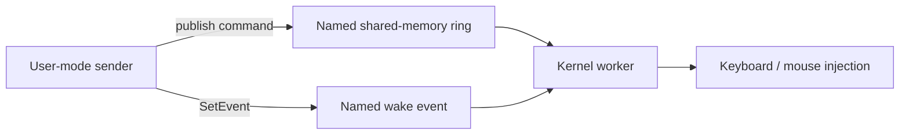

<div align="center">

# HID Inject

**Event-driven keyboard and mouse input experiments for Windows kernel mode**

`Windows x64` · `C++` · `EWDK` · `KDMapper` · `MIT`

</div>

---

HID Inject is a small research project that sends keyboard and mouse commands from a user-mode client to a kernel worker. The current implementation uses a named shared-memory queue and an event: the client publishes a command, signals the event, and the worker consumes the command. There is no command-file polling in the active driver.

> [!NOTE]
> This is an experimental, manually mapped driver, not a packaged Windows input driver. Its mouse path inspects internal `mouclass` state and depends on layout details that can change between Windows builds. Test changes on a machine where a kernel crash can be diagnosed and recovered.

> [!IMPORTANT]
> **KDMapper is required to run this build.** The driver is designed for manual mapping and does not initialize through the conventional Windows driver installation or Service Control Manager path. It has no INF package, standard `DriverEntry` setup, or `IoCreateDevice` endpoint. Loading the `.sys` as a conventional driver will not provide the environment this code expects.

## At a glance

| | Current implementation |
|---|---|
| **Transport** | Named shared-memory section + auto-reset event |
| **Queue** | 256 records, 16 bytes each, one producer and one consumer |
| **Input** | Relative/absolute mouse packets, mouse buttons, keyboard scan codes |
| **Idle behavior** | Worker waits for an event with no polling timeout |
| **Access** | LocalSystem or an elevated Administrators process |
| **Entrypoint** | `DriverMain` starts a system thread and returns |
| **Loader** | [KDMapper](https://github.com/TheCruZ/kdmapper), required for this build |



The section and event retain the historical `Global\HidInjectMouseQueueV1` and `Global\HidInjectMouseWakeV1` names. Their binary layout is unchanged from the mouse-only shared-memory prototype; command mode `20` adds keyboard input to the same queue.

## Try it

First load `combined/x64/hid-inject-shared-input.sys` with KDMapper. The bundled mapper executable is `combined/x64/kdmapper_Release.exe`. Then use an **elevated PowerShell** for the sender commands below. Run only one mapped instance at a time; an existing instance holds the named event and prevents another from starting.

```powershell
# Move the mouse 40 units to the right.
& '.\combined\x64\hid-inject-shared-send.exe' 0 40 0

# Press and release W (scan code 0x11 = 17).
& '.\combined\x64\hid-inject-shared-send.exe' 20 17 0

# Three-second lead-in, then repeat WDSAWDSAWDSA for five seconds.
powershell.exe -NoProfile -ExecutionPolicy Bypass -File '.\combined\x64\test-wdsawdsawdsa.ps1'
```

The commands above assume the shell is at the repository root. The test script gives you three seconds to focus the target window. For sustained input, keep one sender process open with `--stdin` and write one `MODE X Y` record per line; starting a new process for every command adds avoidable overhead.

### Command reference

| Mode | `X` | `Y` | Action |
|---:|---:|---:|---|
| `0` | Delta X | Delta Y | Relative mouse movement |
| `1` | Absolute X | Absolute Y | Absolute mouse packet |
| `2` / `3` | Ignored | Ignored | Left / right click |
| `4` / `5` | Ignored | Ignored | Left button down / up |
| `6` / `7` | Ignored | Ignored | Right button down / up |
| `20` | Scan code | `0`, `1`, or `2` | Keyboard tap, down, or up |
| `-1` | Ignored | Ignored | Stop the worker |

Mouse click modes currently send `DOWN` and `UP` consecutively, without the 80 ms pause used in an earlier prototype. Keyboard tap mode retains a 10 ms gap between press and release. These are input timings, not IPC polling.

## Repository map

```text
combined/
├── src/
│   └── hid-inject-shared-input.cpp   # active driver source
├── x64/
│   ├── hid-inject-shared-input.sys   # current build
│   ├── hid-inject-shared-send.exe    # user-mode sender
│   ├── kdmapper_Release.exe          # mapper used by the project
│   └── test-wdsawdsawdsa.ps1        # keyboard smoke test
└── backups/                       # earlier sources, binaries, and notes
    └── tools/
        └── hid-inject-shared-send.cpp
```

The active `.cpp` is the source of truth. The documents and implementations under `backups/` describe earlier file-polling and mouse-only variants.

## Build and development

The current driver was built for **x64 with EWDK 28000**, using `/kernel /GS-`, `DriverMain` as the linker entrypoint, and `ntoskrnl.lib` plus `hal.lib`. The sender is a Win32 x64 console program. This repository currently contains the resulting binaries, but no portable build script or Visual Studio project for the active variant.

The driver has no `IoCreateDevice` endpoint or IOCTL interface. `DriverMain` does not use its mapper-supplied parameters and returns after starting `PsCreateSystemThread`. Keep the mapped image resident while that worker runs; mapping it with `--free` would invalidate executing code. A normal signed-driver installation flow is not implemented for this project.

In DebugView, enable **Capture Kernel** and filter for `[hid][shm]` to see queue initialization, the first commands, sampled traffic, keyboard commands, and shutdown totals.

## Status

The shared-memory mouse movement and repeated keyboard input were exercised successfully on the development machine. There are no automated kernel tests or published latency benchmarks. The direct `mouclass` path, layout discovery, and immediate click timing remain areas to validate on each target Windows build.

## License and credits

HID Inject is released under the [MIT License](LICENSE), © 2026 dzn0.

This project depends on **[KDMapper](https://github.com/TheCruZ/kdmapper)** for manual loading. Credit to **[TheCruZ](https://github.com/TheCruZ)** for maintaining and improving KDMapper. The [upstream project](https://github.com/TheCruZ/kdmapper#creators-and-contributors) identifies **[z175](https://github.com/z175)** as its original creator. KDMapper is MIT-licensed; its copyright and license notice are preserved in [Third-Party Notices](THIRD_PARTY_NOTICES.md).
